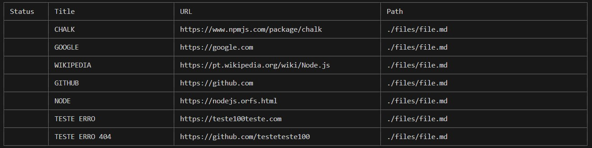
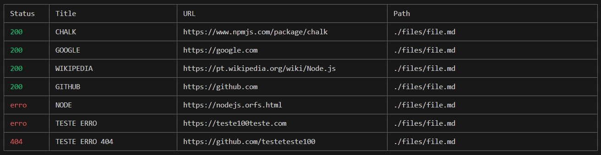
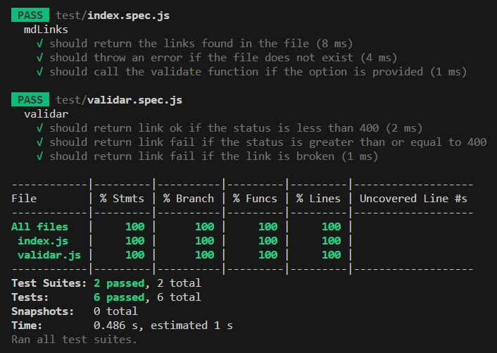

# Markdown Links

## Índice

* [1. Como usar](#1-como-usar)
* [2. Testes](#2-testes)
* [4. Developer](#3-developer)

***

## 1. Como usar 

1. Instalar
( digite no terminal: npm i md-links-bastosmkarina )

2. Tenha acesso aos links disponíveis 
(Digite no terminal o comando: node cli.js ./files/file.md) 

3. Vizualize links que estão corretos ou quebrados
(Digite no terminal o comando: node cli.js ./files/file.md --validate )

## 2. Testes

## 3. Developer

Karina Bastos

[Linkedin](https://www.linkedin.com/in/karinambastos/)